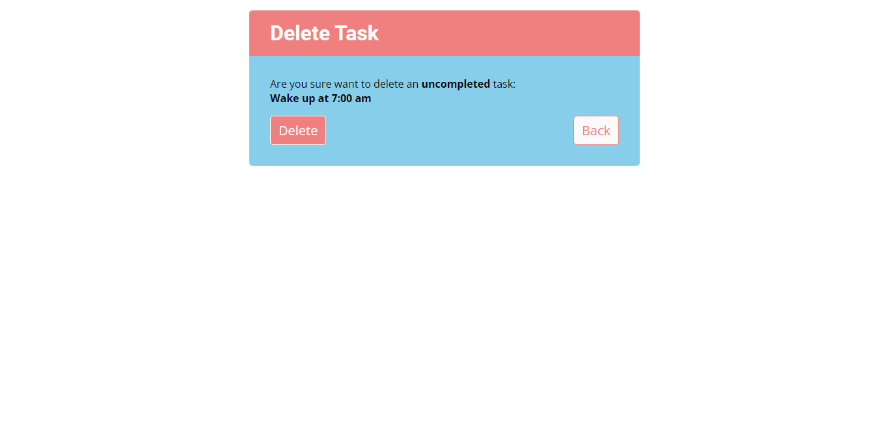

<div align="center">
<h1>Django todo app</h1>
<em>a small django prject</em>
</div>


## Functionality
+ user signin, signup, signout
+ create / update / delete tasks
+ search task
+ info / warn / error messages


## Requirements
+ python (used 3.11.0)
+ django (used 4.2.2)
+ git (optional)


## How to Run
Must have above requirements satisfied.
1. Download the zip and extract it OR clone (requires git) this repository.
2. In terminal, go to the directory where manage.py file is located.
3. Run following command (create database and tables)
```
python manage.py migrate
```
4. Run the project using the command
```
python manage.py runserver
```
5. Open browser and type `localhost:8000/todo/` in url.
6. Use `ctrl+c` in terminal to stop the project.


## Quick View of project

<div align="center">
    <p>Index page</p>
    
</div>
<br>
<div align="center">
    <p>Signup page</p>
    
</div>
<br>
<div align="center">
    <p>Signin page</p>
    
</div>
<br>
<div align="center">
    <p>Tasks page</p>
    
</div>
<br>
<div align="center">
    <p>Task create page</p>
    
</div>
<br>
<div align="center">
    <p>Task update page</p>
    
</div>
<br>
<div align="center">
    <p>Task delete page</p>
    
</div>
<br>
<div align="center">
    <p>Task search</p>
    
</div>
<br>
<div align="center">
    <p>Message popup</p>
    
</div>

